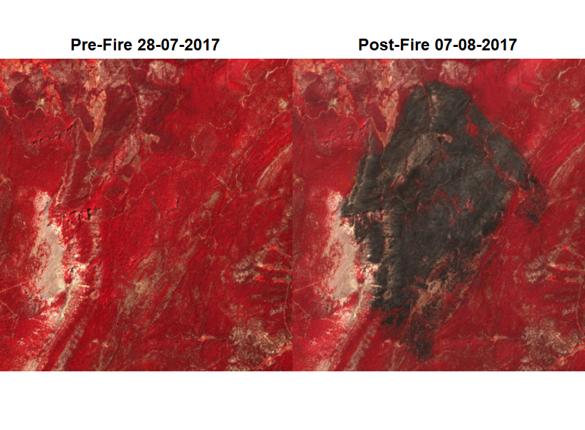
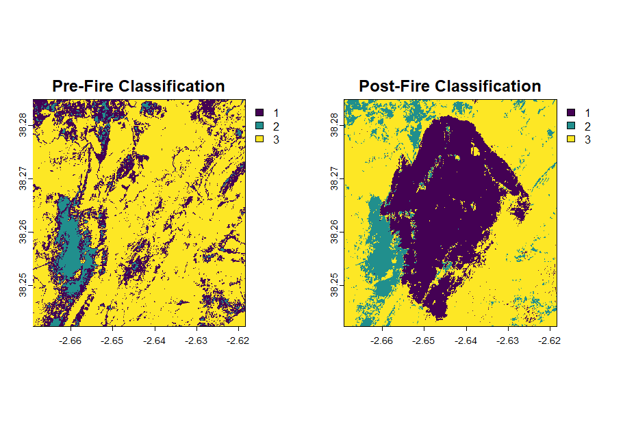
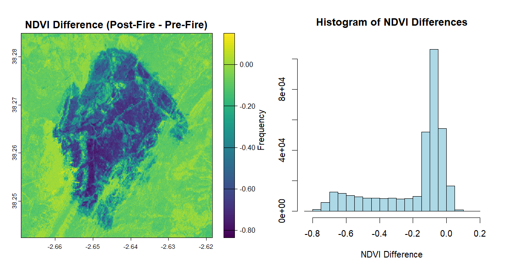
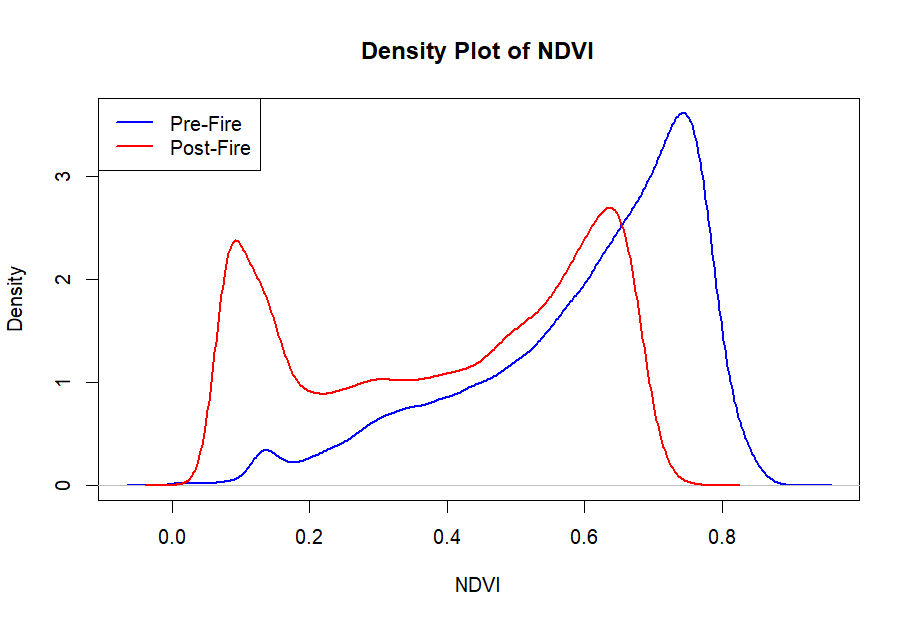
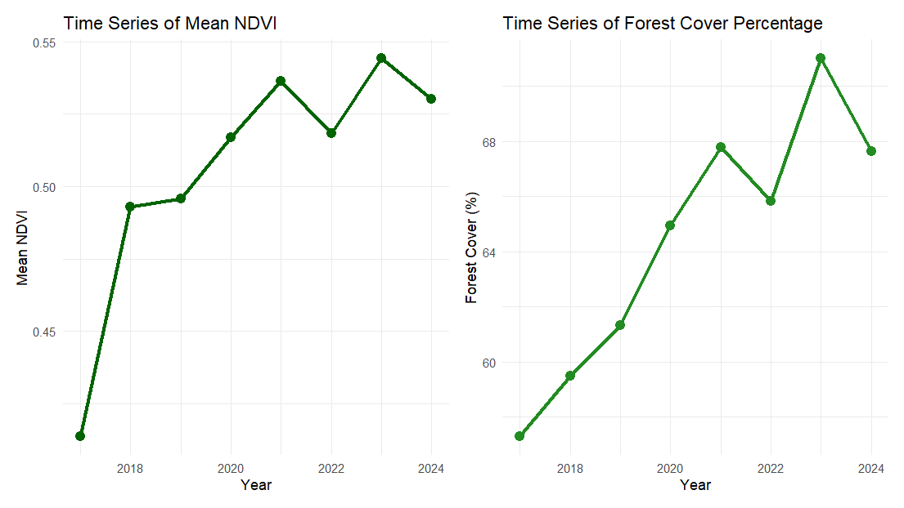

# 📍 Evaluating Vegetation Loss Due to Wildfire

## 🌳 Project Overview
This project analyzes vegetation loss and recovery in **Segura De La Sierra** following the 2017 wildfire, using **remote sensing techniques in R**. The study leverages **Sentinel-2 imagery**, **NDVI analysis**, **image classification**, and **time series monitoring** to assess forest loss and regrowth over time.

📅 **Event:** August 3, 2017  
📍 **Location:** Segura De La Sierra, Natural Park of Cazorla, Segura y Las Villas, Spain  
🎯 **Objective:** Assessing fire impact and monitoring forest recovery using spatial analysis in R.

---

## 🛠️ Methodology

### 1️⃣ Image Acquisition
- **Data Source:** Sentinel-2 (via **Copernicus Browser**)
- **Selection Criteria:** Low cloud coverage, appropriate spectral bands (NIR, RED, GREEN)
- **Format:** High-resolution **TIFF (8-bit)**

### 2️⃣ Image Preprocessing & Visualization
- Loading satellite images into R
- Plotting **false-color composites (NIR-Red-Green)** to highlight vegetation

### 3️⃣ Land Cover Classification
- **K-Means clustering** applied to categorize pixels into vegetation, non-vegetation, and burned areas.
- **Class frequency analysis** to determine forest loss.

### 4️⃣ NDVI Computation & Vegetation Loss Analysis
- **Normalized Difference Vegetation Index (NDVI)** calculated to quantify vegetation health.
- Vegetation threshold: **NDVI > 0.4** used to determine forest cover.
- **Pre-fire vegetated area:** **85.12%**
- **Post-fire vegetated area:** **54.69%**

### 5️⃣ NDVI Density Forest Analysis
- **Density plots** were created to analyze the distribution of NDVI values before and after the wildfire.
- These plots highlight the shift from a dense, healthy forest to a landscape with lower NDVI values post-fire.

### 6️⃣ Time Series Analysis – Forest Recovery (2017-2024)
- Sentinel-2 images analyzed annually from **2017 to 2024**.
- Mean NDVI and forest cover percentage computed for each year.
- **Trend Visualization:** Recovery patterns analyzed over time.

---

## 📊 Results & Findings
✅ **Significant initial vegetation loss**, with NDVI dropping sharply post-fire.  
✅ **K-Means and NDVI effectively mapped fire damage and vegetation trends**.  
✅ **Time series analysis confirmed gradual regrowth**, though recovery is still incomplete.  
✅ **Remote sensing proved valuable for continuous ecological monitoring.**  

---

## 👤 Author
**Simone Santoro** – *Spatial Ecology in R, A.Y. 2024/2025*  
